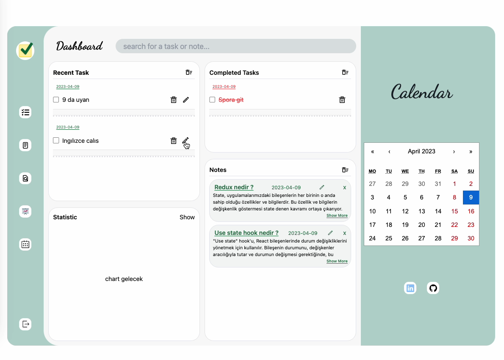

## Getting Started

```bash
npm run dev, 
yarn dev, 
pnpm dev
```
## Libraries used

- Next js
- Redux/toolkit
- tailwind css 
- react icons
- https://www.npmjs.com/package/react-outside-click-handler

## live : https://todoaoo.netlify.app/tr-TR

